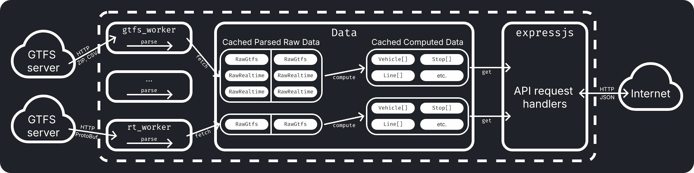

# Projekt z Projektowania Aplikacji Internetowych

Projekt jest platformą, która umożliwia użytkownikom przeglądanie danych opublikowanych przez organizatorów transportu publicznego.
Interfejs składa się z mapy pokazującej przystanki, pojazdy, i linie oraz z panelu bocznego z menu.
Serwer jest odpowiedzialny za zarządzanie użytkownikami, konfigurację źródeł danych, pobieranie i przetwarzanie danych źródłowych, i udostępnienie danych przez API.

## Architektura

Projekt składa się z [frontendu](./website/) w Typescript + Preact i [serwera](./server/) w Typescript + express.js.
Serwer ma architekturę "warstwową" - przychodzące zapytania o dane z [GTFS](https://en.wikipedia.org/wiki/GTFS)(-[RT](https://en.wikipedia.org/wiki/GTFS_Realtime)) są obsługiwane po kolei przez:

1. Cache gotowych danych jeśli jest świeży
1. Cache sparsowanych danych źródłowych z których obliczane są gotowe dane jeśli jest świeży
1. Dane źródłowe pobierane i parsowane przez workerów

Pobieranie i wstępne przetwarzanie danych jest wykonywane przez osobne workery asynchronicznie, ponieważ jest to wolny proces który zależnie od źródła danych może zająć do kilkunastu/kilkudziesięciu sekund.

API można podzielić na trzy części:

- autoryzacja (zalogowani użytkownicy mogą tworzyć i edytować konfigurację źródeł danych)
- konfiguracja (źródła danych mogą być konfigurowane przez zalogowanych użytkowników, inni mogą konfigurację odczytać)
- dane (główna część - zwraca informacje wydobyte z danych źródłowych)

Więcej informacji o API znajduje się [w dokumentacji](./docs/api.md).

Cache są inwalidowane automatycznie po upływie skonfigurowanego czasu świeżości (zależy od konfiguracji źródła danych).
Domyślnie, cache jest automatycznie wypełniany i odświeżany przez serwer - można to zmienić odpowiednio przy pomocy flag serwera `--no-precache` i `--no-refetch`.

## Uruchomienie

Projekt można uruchomić używając [`docker compose`](https://docs.docker.com/compose/):

1. Stworzyć plik konfiguracyjny `.env` na podstawie [`.env.example`](./.env.example) i wypełnić odpowiednio pola
1. Zbudować kontenery przy użyciu `docker compose build`
1. Uruchomić kontenery przy użyciu `docker compose up`

[`docker-compose.yaml`](./docker-compose.yaml) ma zdefiniowaną serwer backendowy, serwer dla frontendu (nginx), bazę danych (PostgreSQL), i reverse proxy (traefik; dzięki któremu certyfikaty TLS mogą być automatycznie stwarzane).

## Administracja Bazą Danych

Migracje na bazie danych mogą być przeprowadzone używając komendy `npm run migrate` (i `npm run unmigrate` aby powrócić do poprzedniego stanu) wykonanej w [`/server/`](./server/).
Przykładowe dane mogą być dodane do bazy danych używając komendy `npm run seed` (i `npm run unseed` aby je usunąć) wykonanej w [`/server/`](./server/).
