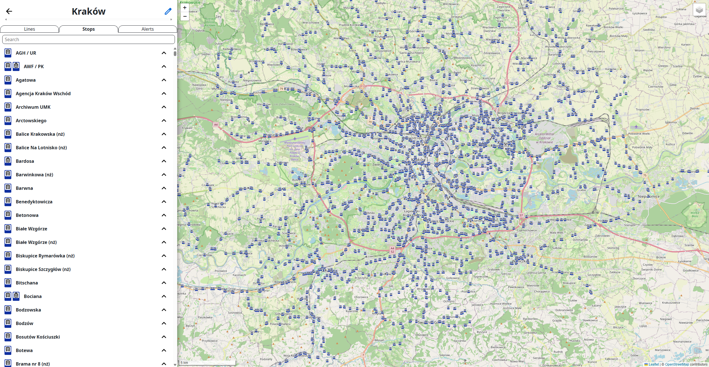

# Projekt z Projektowania Aplikacji Internetowych

Projekt jest platformą, która umożliwia użytkownikom przeglądanie danych opublikowanych przez organizatorów transportu publicznego.
Interfejs składa się z mapy pokazującej przystanki, pojazdy, i linie oraz z panelu bocznego z menu.
Serwer jest odpowiedzialny za zarządzanie użytkownikami, konfigurację źródeł danych, pobieranie i przetwarzanie danych źródłowych, i udostępnienie danych przez API.

